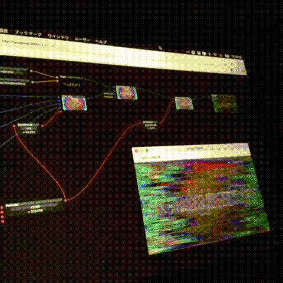

# Nightbird - modular visual performer on browser

  

ブラウザ上で動くVJソフトです。  
モジュラーウインドウに次々とnodeをdrag & dropしていくことで、オリジナルのビジュアルパフォーマンスシステムを組むことができます。

### 操作方法
- gifであれglslであれnodeであれ、とりあえずdrag & dropしてください
- nodeは操作不可領域（ボタンやテキストボックス以外）を掴んでウインドウ上を自由に動かせます
- nodeの左右に付いている丸はconnectorです。ドラッグして他のコネクタとつなぎ合わせれば、接続ができます
- inputからinput、outputからoutputには接続できません
- 同じ型（色）同士のコネクタしか接続できません
- 青がcanvas型（映像）、赤がnumber型（数字）、黄がstring型（文字列）
- canvasのinputが一つだけ付いている、Masterという少し大きなノードにcanvasをつなげると、サブウインドウに映像が表示されます
- node上で右クリックすると、コンテクストメニューが表示されます
- 左クリックで範囲選択することができます
- 範囲選択したnodeをまとめて移動できます
- 範囲選択したnode上で右クリックすると、コンテクストメニューが表示されます

### 対応ファイル形式
- gif - パラメータでフレームを制御できます
- glsl（板ポリゴン） - 4テクスチャ、4パラメータを入力可能
- mp4, webm - 動画も使えます（制御はまだできない）
- jpg, png - 画像も使えます
